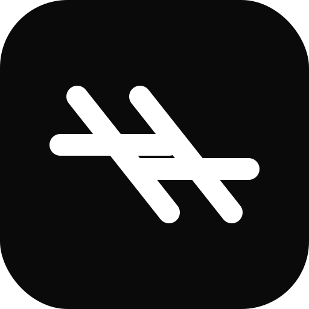

# TransFloat 译浮

A lightweight macOS menu bar app that translates selected text and displays the result as a floating "desktop lyrics" bar at the bottom of your screen.



## Features

- **Select & Translate**: Select any text in any app, press `⌃⌥D` (Control+Option+D) to translate
- **Floating Bar**: Translation appears as a sleek, semi-transparent bar at the bottom of the screen
- **Auto Dismiss**: Bar disappears after 3 seconds, hover to keep it visible
- **10 Languages**: Switch target language from the menu bar (Chinese, English, Japanese, Korean, French, German, Spanish, Russian, Dutch, Traditional Chinese)
- **Free**: Uses Google Translate — no API key needed
- **Lightweight**: Pure Swift, no Electron, no dependencies

## Requirements

- macOS 13.0+
- Accessibility permission (required for global hotkey and simulated copy)

## Build & Run

```bash
# Build
bash build.sh

# Run
./TransFloat.app/Contents/MacOS/TransFloat

# Or after registering with Launch Services:
open TransFloat.app
```

## Usage

1. Launch TransFloat — a 🌐 globe icon appears in the menu bar
2. Grant Accessibility permission when prompted (System Settings → Privacy & Security → Accessibility)
3. Select any text in any app
4. Press **⌃⌥D** (Control + Option + D)
5. Translation appears at the bottom of the screen

### Menu Bar Options

- **Toggle translation** on/off
- **Change target language** via submenu
- **Test translation** with a sample sentence
- **Quit** the app

## Tech Stack

- Swift 5.9 / macOS 13+
- AppKit (NSPanel, NSStatusBar)
- SwiftUI (floating bar view)
- Carbon (RegisterEventHotKey for global hotkey)
- Google Translate free API
